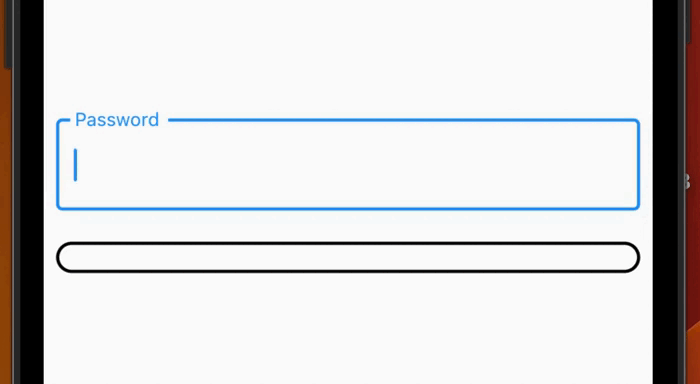

# PasswordStrengthChecker
This is a Widget to check the strength of the password in a visual way, with an animation when the strength changes according to the settings given by the user.

## Features


## Getting started
You can use the default `PasswordStrength` enum to set the strength of the password, or you can create your own enum that implements `PasswordStrengthItem` and use it. For example:

```dart
enum CustomPassStrength implements PasswordStrengthItem {
  weak,
  medium,
  strong;

  @override
  Color get statusColor {
    switch (this) {
      case CustomPassStrength.weak:
        return Colors.red;
      case CustomPassStrength.medium:
        return Colors.orange;
      case CustomPassStrength.strong:
        return Colors.green;
    }
  }

  @override
  Widget? get statusWidget {
    switch (this) {
      case CustomPassStrength.weak:
        return const Text('Weak');
      case CustomPassStrength.medium:
        return const Text('Medium');
      case CustomPassStrength.strong:
        return const Text('Strong');
      default:
        return null;
    }
  }

  @override
  double get widthPerc {
    switch (this) {
      case CustomPassStrength.weak:
        return 0.15;
      case CustomPassStrength.medium:
        return 0.4;
      case CustomPassStrength.strong:
        return 0.75;
      default:
        return 0.0;
    }
  }

  static CustomPassStrength? calculate({required String text}) {
    // Implement your custom logic here
    if (text.isEmpty) {
      return null;
    }
    if (text.length < 6) {
      return CustomPassStrength.weak;
    } else if (text.length < 10) {
      return CustomPassStrength.medium;
    } else {
      return CustomPassStrength.strong;
    }
  }
}
```

## Usage
```dart
import 'package:flutter/material.dart';
import 'package:password_strength_checker/password_strength_checker.dart';

class HomePage extends StatelessWidget {
  const HomePage({Key? key}) : super(key: key);

  @override
  Widget build(BuildContext context) {
    final passNotifier = ValueNotifier<PasswordStrength?>(null);

    return Scaffold(
      body: Padding(
        padding: const EdgeInsets.all(8.0),
        child: Column(
          mainAxisAlignment: MainAxisAlignment.center,
          children: [
            TextField(
              decoration: const InputDecoration(
                border: OutlineInputBorder(),
                labelText: 'Password',
              ),
              onChanged: (value) {
                passNotifier.value = PasswordStrength.calculate(text: value);
              },
            ),
            const SizedBox(height: 20),
            PasswordStrengthChecker(
              strength: passNotifier,
            ),
          ],
        ),
      ),
    );
  }
}
```
